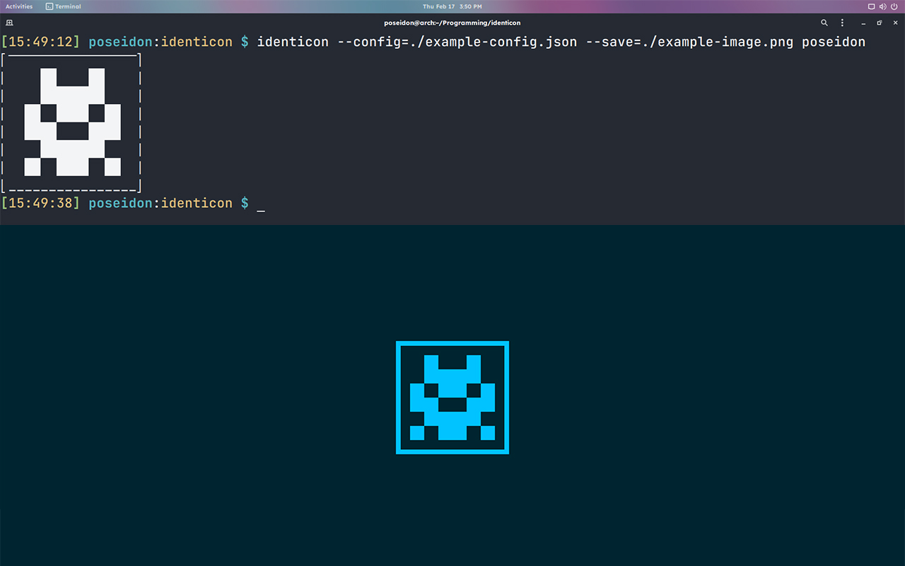

<div align="center">


<sup>This identicon was generated using the SHA512 hash of the [main.go](./main.go) file of this program.</sup>

Cross-platform CLI program to generate identicons based on some string passed as arguement and save as a PNG image.

```sh
identicon --config=./assets/example-config.json --save=./assets/example-image.png poseidon
```


<sup>The config file in this usage example is [example-config.json](./assets/example-config.json). The generated image using that config file is [example-image.png](./assets/example-image.png)</sup>

</div>

# Table of Contents

- [Table of Contents](#table-of-contents)
- [Usage](#usage)
- [Prerequisites](#prerequisites)
- [Installing](#installing)
- [Uninstalling](#uninstalling)
- [Releases](#releases)
- [Building](#building)
- [License](#license)

# Usage

| GENERAL FLAGS     | USAGE                                  | EXAMPLE                                           |
| ----------------- | -------------------------------------- | ------------------------------------------------- |
| `-h`, `--help`    | list available options                 | `identicon -h`                                    |
| `--config` _path_ | path to any supported config.json file | `identicon --config=./example-config.json <text>` |
| `--save` _path_   | saves image to the specified directory | `identicon --save=./example-image.png <text>`     |

| IDENTICON FLAGS   | USAGE                                                                          | EXAMPLE                        |
| ----------------- | ------------------------------------------------------------------------------ | ------------------------------ |
| `--size` _number_ | sets size of the identicon (range: 4-8) **(default 6)**                        | `identicon --size=8 <text>`    |
| `--border`        | adds a border to the identicon                                                 | `identicon --border <text>`    |
| `--square`        | creates a square identicon                                                     | `identicon --square <text>`    |
| `--invert`        | inverts the cell filling of identicon                                          | `identicon --invert <text>`    |
| `--vertical`      | creates identicon in portrait dimension (not visible on using `--square` flag) | `identicon --vertical <text>`  |
| `--symmetric`     | creates symmetric identicon                                                    | `identicon --symmetric <text>` |

| IMAGE FLAGS                 | USAGE                                                                | EXAMPLE _(compulsory to use `--save` flag with any Image Flags)_ |
| --------------------------- | -------------------------------------------------------------------- | ---------------------------------------------------------------- |
| `--image-size` _character_  | saves image with given resolution preset (S,M,L,X) **(default "L")** | `identicon --image-size=M --save=./example-image.png <text>`     |
| `--image-portrait`          | saves image with portrait dimensions                                 | `identicon --image-portrait --save=./example-image.png <text>`   |
| `--fg` _6-digit HEX-string_ | sets image's foreground color **(default "6dff24")**                 | `identicon --fg=a4f3dd --save=./example-image.png <text>`        |
| `--bg` _6-digit HEX-string_ | sets image's background color **(default "0b2100")**                 | `identicon --bg=04a034 --save=./example-image.png <text>`        |

# Prerequisites

-   [**go**](https://go.dev/) `>=1.17`
-   [**git**](https://git-scm.com/) `latest`
-   [**make**](https://www.gnu.org/software/make/) `latest`

_(if using **Unix-like** operating systems, chances are, all the above prerequisites were already met, except may be `Go` - can be installed using OS's package manager)_

_(other operating systems should consult uncle Google for such requirements, or can just build from source code - check [Building](#building))_

# Installing

1. Clone/[Download](https://github.com/poseidon-code/identicon/archive/refs/heads/main.zip) this repository
2. Go into the cloned/downloaded repository
3. Use `sudo make install` command to install it globally _(if you are using any OS other than Linux you may not have `sudo` & `make` programs, for `sudo` consult your OS's guide to **raising user priveleges**, and for `make` you will need to install it from [here](https://www.gnu.org/software/make/), specific to your OS)_
4. After installing, you can delete the cloned/downloaded folder

**Level: 1000 ? Copy-Paste this &darr;**
_(assuming you are in a Linux/Unix-like OS, if you are on any other OS then follow the above steps relative to your OS)_

```sh
git clone https://github.com/poseidon-code/identicon
cd ./identicon
sudo make install
cd ..
rm -rf ./identicon
```

# Uninstalling

1. Go into the cloned/downloaded repository
2. Use `sudo make uninstall` command to uninstall it globally. It will literally remove the binary from `/usr/bin/identicon`. _(if you are using any OS other than Linux you may not have `sudo` & `make` programs, for `sudo` consult your OS's guide to **raising user priveleges**, and for `make` you will need to install it from [here](https://www.gnu.org/software/make/), specific to your OS)_
3. After uninstalling, you can delete the cloned/downloaded folder

```sh
cd ./identicon
sudo make uninstall
cd ..
rm -rf ./identicon
```

# Releases

Pre-compiled 64-bit architecture binaries are available for Windows, Linux & macOS operating systems. Check out the [Github Releases](https://github.com/poseidon-code/identicon/releases) page for downloading your OS specific binary.

# Building

Building a Go program is the easiest of all. All you need is `Go` installed in your system _([Download & Install Go](https://go.dev/))_. To build a binary for your operating system & architecture, follow these steps :

1. Clone/[Download](https://github.com/poseidon-code/identicon/archive/refs/heads/main.zip) this repository
2. Go into the cloned/downloaded repository
3. Use `go build github.com/poseidon-code/identicon` command to build your own binary
4. Copy/Move the generated `identicon` binary to where ever you wish to access it from _(most prefferably, some directory which is exported to global `$PATH`, to access it globally - may require `root`/`administrator` privileges)_
5. After copying over to some directory, you can always delete the cloned/downloaded repository folder

**Level: 1000 ? Copy-Paste this &darr;**
_(assuming you are in a Linux/Unix-like OS, if you are on any other OS then follow the above steps as per your OS)_

```sh
git clone https://github.com/poseidon-code/identicon
cd ./identicon
go build github.com/poseidon-code/identicon
sudo cp ./identicon /usr/bin/
cd ..
rm -rf ./identicon
```

# License

MIT License

Copyright (c) 2022 Pritam Halder

Permission is hereby granted, free of charge, to any person obtaining a copy
of this software and associated documentation files (the "Software"), to deal
in the Software without restriction, including without limitation the rights
to use, copy, modify, merge, publish, distribute, sublicense, and/or sell
copies of the Software, and to permit persons to whom the Software is
furnished to do so, subject to the following conditions:

The above copyright notice and this permission notice shall be included in all
copies or substantial portions of the Software.

THE SOFTWARE IS PROVIDED "AS IS", WITHOUT WARRANTY OF ANY KIND, EXPRESS OR
IMPLIED, INCLUDING BUT NOT LIMITED TO THE WARRANTIES OF MERCHANTABILITY,
FITNESS FOR A PARTICULAR PURPOSE AND NONINFRINGEMENT. IN NO EVENT SHALL THE
AUTHORS OR COPYRIGHT HOLDERS BE LIABLE FOR ANY CLAIM, DAMAGES OR OTHER
LIABILITY, WHETHER IN AN ACTION OF CONTRACT, TORT OR OTHERWISE, ARISING FROM,
OUT OF OR IN CONNECTION WITH THE SOFTWARE OR THE USE OR OTHER DEALINGS IN THE
SOFTWARE.
